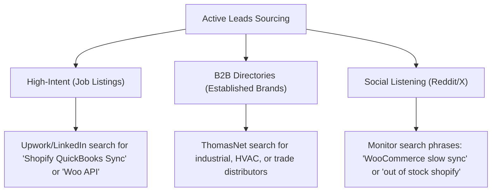
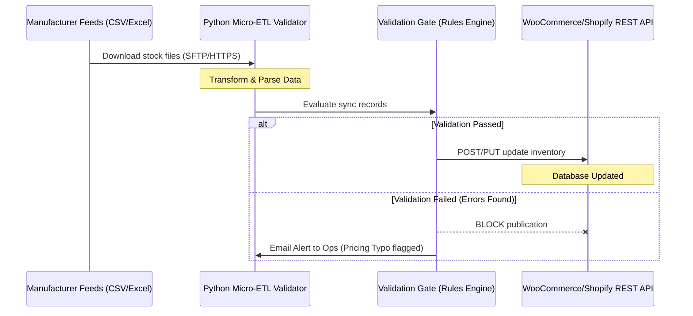

# Master Playbook: Scaling Custom E-Commerce Integrations

This study guide provides a comprehensive blueprint for landing high-paying clients, architecting robust inventory integrations, and scaling your e-commerce integration business to **$10,000/month**.

---

## 1. The Integration Agency Business Model

E-commerce wholesalers and distributors handle thousands of product SKUs. Their inventory levels and prices change constantly as manufacturers update catalogs. 

When done manually, copy-pasting data from supplier spreadsheets leads to **costly stockouts** (selling out-of-stock items, resulting in refunded orders and lost customers) and **pricing typos** (selling expensive parts at a loss).

Our agency builds **custom micro-services** that connect manufacturer inventory data directly to WooCommerce and Shopify store APIs, charging premium rates for custom code and monthly maintenance.

### Monetization Channels

| Service Tier | Price Range | Description |
| :--- | :--- | :--- |
| **Custom Integration Script** | **$1,500 – $4,500** | One-time setup: Scrapes/reads supplier sheets (CSV, Excel) and syncs to store API. |
| **Validation Gate Add-on** | **$500 – $1,000** | Premium add-on: Checks for negative values, price drops, or SKU formatting errors. |
| **Monthly Maintenance SLA** | **$150 – $350 / mo** | 24/7 cloud monitoring, bug fixes, and API compliance updates. |

---

## 2. Client Sourcing & Lead Acquisition Workflow

Instead of sending thousands of spam emails, we source high-intent, signal-based leads.

### Sourcing Channels

1.  **Upwork Feed Scraping (Highest Conversion):**
    *   *Why:* Wholesalers post jobs on Upwork when their manual processes break. They have a budget and need help immediately.
    *   *Search terms:* `QuickBooks Shopify sync`, `WooCommerce ERP integration`, `supplier CSV import script`, `Sage inventory update`.
2.  **ThomasNet Sourcing:**
    *   *Why:* ThomasNet is the largest industrial supplier directory in North America. It hosts traditional brick-and-mortar trade distributors who frequently have massive catalog needs but lack modern IT departments.
    *   *Search terms:* Industrial suppliers, electrical component manufacturers, piping supply wholesalers, heavy equipment distributors.
3.  **Active Google/DDG Crawling:**
    *   *Why:* Our crawler uses public search results to find active storefronts on Shopify and WooCommerce within wholesale niches, parsing their contact pages to scrape public sales/info emails.

---

## 3. High-Ticket Technical Architecture

When pitching to developers or IT managers, you must demonstrate deep technical authority. Use this structure to explain how your integrations work:

### Integration Best Practices

*   **SKUs as the Source of Truth:** Never attempt to sync products using database IDs (which differ between platforms). Always use the manufacturer SKU as the primary key.
*   **Webhooks vs. Polling:** 
    *   Use **Webhooks** for real-time inventory deduction when an order is placed on the store.
    *   Use **Scheduled Polling** (e.g., cron job every 15–30 minutes) to check the manufacturer's supplier feeds for stock changes.
*   **API Rate Limit Handling:** 
    *   Shopify REST API allows 4 requests per second (Shopify Plus allows 8).
    *   WooCommerce REST API is limited by the server's CPU.
    *   Always implement request batching or rate limiting inside your Python scripts (using tools like `time.sleep()`) to prevent `429 Rate Limit Exceeded` errors.

---

## 4. Outreach Playbook

To win clients, your outreach must speak directly to high-stakes business problems.

### Two-Tiered Outreach Email Blueprint

> **Subject:** Quick question about inventory updates for [Company Name]
>
> Hi [Name],
>
> I came across [Company Name] ([Website]) and noticed you run a massive catalog on [Shopify/WooCommerce].
>
> Managing stock sheets and price updates from multiple manufacturers usually takes hours of manual spreadsheets for your team, and risks costly pricing typos on the store (like accidentally selling items below cost).
>
> I set up a lightweight integration script that automates this. It reads your supplier stock files and updates your [Shopify/WooCommerce] catalog automatically, which saves your team significant time, money, and labor by eliminating manual spreadsheet data entry and protecting your margins. It also includes an automatic check to flag pricing typos before they go live.
>
> Would it be alright if I sent over a quick text walkthrough of how we can hook this up to your current supplier feeds to save your team time, money, and labor?
>
> Best regards,
>
> Aum  
> Integration Specialist
>
> **P.S.** If you have an IT manager or web developer, you can forward them this simple 60-second system flowchart to show how the database validation works:  
> https://raw.githubusercontent.com/Aum31/inventory-sync-diagram/main/system_flow.png

### 5 Tips for Successful Outreach
1.  **Never Say "I Can Build Anything":** Position yourself as a specialist in *Inventory Sync and ERP Integrations*.
2.  **Keep Demos Low-Friction:** Don't force them into a 30-minute Zoom call. Offer a 5-minute Loom video or a quick text walkthrough.
3.  **Use the "Validation Gate" Hook:** Wholesalers are terrified of losing money from pricing mistakes. Emphasize that your script catches negative values and price drops before they push to the store.
4.  **Target the Right Decision-Maker:** Send DMs or emails to "Director of Operations," "E-commerce Manager," or "Supply Chain Coordinator."
5.  **Follow Up Twice:** Send a follow-up email 3 days later, keeping it short: *"Hey [Name], just wanted to see if manual catalog updates are still a bottleneck for your team?"*
