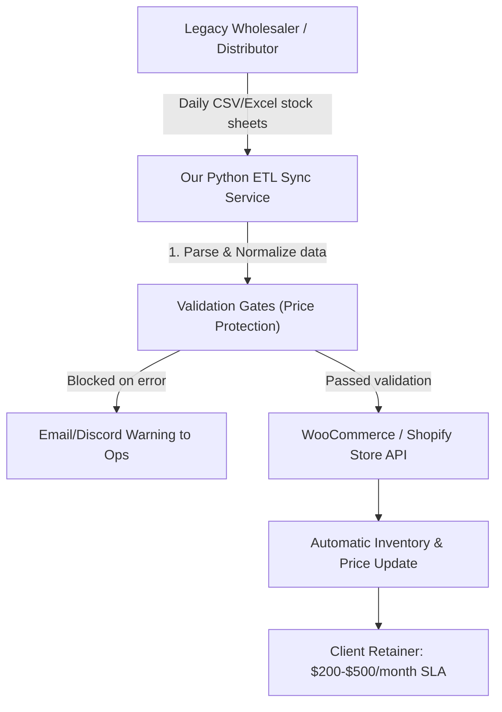

# Business Model Analysis: B2B Integration vs. Trending Social Media Models

This report provides an objective, research-backed comparison of the B2B E-commerce Integration Agency model against the most popular digital business models currently discussed across YouTube, Reddit, and X (Twitter) in 2026.

---

## 1. Comparison of Business Models

The table below evaluates the top business models based on market saturation, technical requirements, average customer lifetime value (LTV), and ease of client acquisition.

| Business Model | Setup Cost | Technical Skill | Saturation / Competition | Avg. Monthly Retainer / LTV | Client Acquisition |
| :--- | :--- | :--- | :--- | :--- | :--- |
| **B2B E-Commerce Sync Agency** (Our Model) | **Low** ($50–$100 for hosting/domain) | **High** (Python, APIs, ETL logic) | **Very Low** (Too technical for typical online courses) | **High** ($1,500-$4,500 setup + $200-$500/mo) | High-intent cold email & targeted scraping |
| **AI Automation Agency (AAA)** | **Low** (No-code tools) | **Medium** (Make.com, Zapier, prompt eng) | **High** (Highly saturated by YouTube courses) | **Medium** ($500-$1,500 setup + $100-$300/mo) | Direct outreach, LinkedIn networking |
| **Productized Service** (e.g. Video Editing) | **Low** (Sub/Software) | **Medium** (Design, video editing) | **High** (Low barrier to entry) | **Medium** ($1,000-$3,000/mo subscription) | Cold DMs, social media content |
| **Micro-SaaS** | **Medium** (Dev, database, API fees) | **High** (Full-stack dev, cloud infra) | **Medium** (Highly fragmented) | **Low to Medium** ($29-$149/mo per user) | SEO, paid ads, product hunt launches |

---

## 2. In-Depth Analysis of Trending Models

### AI Automation Agency (AAA)
*   **The Hype:** Gurus on YouTube promote building custom AI chatbots, PDF parsers, and auto-blogging pipelines using no-code platforms (Make.com/Zapier).
*   **The Reality:** Small business owners are often skeptical of AI chatbots because they hallucinate and require constant oversight. No-code platforms have high monthly API run costs that eat into margins. 
*   **Verdict:** Highly competitive. To succeed, you must move away from generic chatbots and build deep backend database automations.

### Productized Services (Subscription Agency)
*   **The Hype:** Promoted as "Designjoy for X"—selling unlimited graphic design, copywriting, or short-form video editing for a flat monthly subscription (e.g., $2,000/month).
*   **The Reality:** The model relies on "underutilization" (clients paying but not requesting work). If all clients request work daily, the agency owner becomes a bottleneck and must hire expensive freelancers, eroding profit margins.
*   **Verdict:** Excellent for cash flow, but highly demanding. Requires strong operations and team-management skills to scale.

### Micro-SaaS (Software-as-a-Service)
*   **The Hype:** Build a simple tool (like a Chrome extension or a Shopify app) that solves one specific problem and sell it for a recurring fee.
*   **The Reality:** High technical barrier. Even a simple SaaS requires user authentication, database management, billing integration (Stripe), and hosting. Customer acquisition cost (CAC) can be high, and churn rates are volatile.
*   **Verdict:** The best long-term asset, but takes 6–12 months of unpaid development and marketing before generating significant cash.

---

## 3. Analysis of Our Model: B2B E-Commerce Integration Agency

The B2B E-commerce Integration model involves writing custom Python scripts (like our ETL pipelines) that connect legacy manufacturer databases/spreadsheets directly to Shopify and WooCommerce store APIs.

### Why it is Highly Viable
1.  **High-Stakes Business Pain:** If a wholesaler sells an out-of-stock item because of a manual delay, they lose the customer. If they make a pricing typo, they lose thousands of dollars in a single day. They are highly motivated to pay to solve this.
2.  **Low Competition:** The average "digital marketer" or "no-code developer" cannot write custom Python scripts that safely handle database connections, exceptions, and API rate limits. Your technical skills form a natural barrier to entry.
3.  **High Customer Lifetime Value (LTV):** Once a script is integrated into their store, the client will rarely change it. They will gladly pay a $250–$500/month Service Level Agreement (SLA) just to have you monitor it and fix bugs if the API updates.
4.  **Bypass Paid APIs:** Using zero-cost scrapers and crawlers (like our `duckduckgo-search` setup) allows you to harvest active leads without paying hundreds of dollars for Apollo or Hunter.io accounts.

### The Downside
*   **Longer Sales Cycle:** Wholesalers are traditional brick-and-mortar operations. They do not buy on impulse. It requires multiple touchpoints and demonstrating a proof-of-concept (like our interactive dashboard) to close a deal.

---

## 4. Key Execution Recommendations

To succeed with the B2B Integration Agency model, we recommend focusing on these steps:

1.  **Use the Validation Gate as the Primary Hook:** Wholesalers are terrified of losing money from pricing mistakes. Emphasize that our sync engine blocks negative prices and cost spikes *before* they go live.
2.  **Leverage the Visual Demo:** Send prospects a link to the [Interactive Price Protection Simulator](file:///C:/Users/aumjv/Documents/antigravity/keen-planck/sync_dashboard.html) during outreach. This provides instant, tangible proof of value.
3.  **Target Brick-and-Mortar Distributors:** Focus on traditional trade niches (plumbing, HVAC, welding, electrical, agricultural supply) rather than modern tech brands, as traditional niches have the largest catalog sizes and the oldest software.
